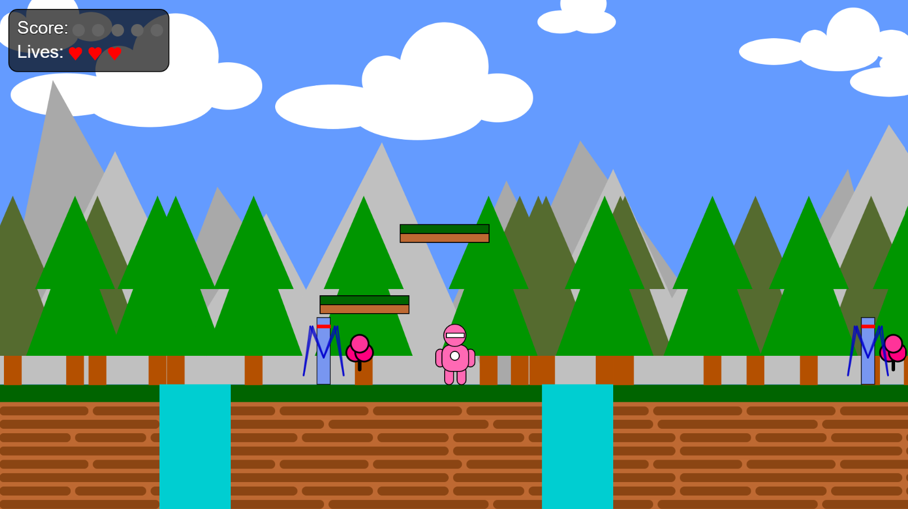
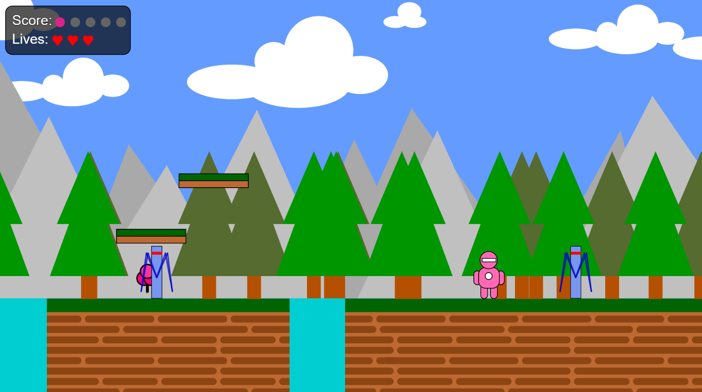
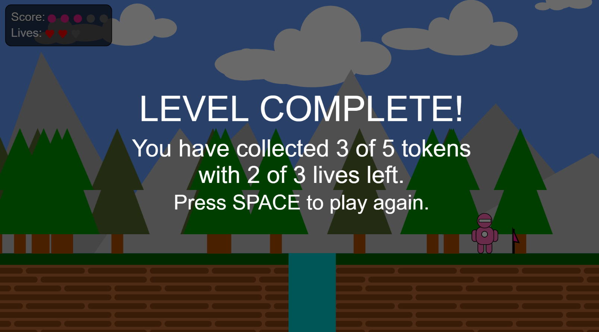
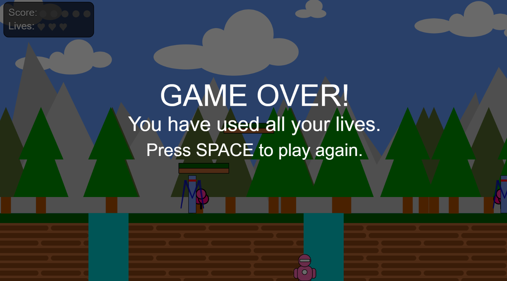

# p5.js Side-Scroller Game

[Play the game online](https://afruza-bhuiyan.github.io/p5js-side-scroller/)

A 2D side-scrolling platform game built using JavaScript and the p5.js library.

The game features character movement, jumping, scrolling environments, enemies, collectables, platforms, canyons, lives, scoring and a level-completion system.

## Gameplay

The player controls a character through a scrolling platform environment while collecting items and avoiding hazards and enemies.

### Features

* Character movement and jumping
* Arrow-key and keyboard controls
* Side-scrolling gameplay
* Collectables and score tracking
* Enemy movement and collision detection
* Platforms
* Canyons and falling mechanics
* Player lives and respawning
* Game-over state
* Level-completion state
* Restart functionality
* Animated character movement
* Animated enemies
* Animated collectables
* Animated flag
* In-game score and lives HUD

## Screenshots

### Main Gameplay

### Collectables and Score

### Level Complete

### Game Over 

 

## Technologies

* JavaScript
* p5.js
* HTML
* CSS

## Programming Concepts

This project demonstrates:

* Functions and conditional logic
* Loops and arrays
* Objects and object constructors
* Keyboard input
* Collision detection
* Game-state management
* Frame-based animation
* Coordinate systems
* Canvas-based rendering

## How to Run

1. Clone or download this repository.
2. Open the project using a local web server.
3. Open `index.html` in your browser.
4. Use the keyboard controls to play.

## Controls

| Key   | Action                                |
| ----- | ------------------------------------- |
| ← / A | Move left                             |
| → / D | Move right                            |
| ↑ / W | Jump                                  |
| ↓ / S | Move down                             |
| Space | Restart after game over or completion |

## Development

This project was originally conceived as part of my university coursework. It was refined farther later on with the focus on improving gameplay reliability, controls, game states, animation, scoring, lives, user interface and overall presentation.
